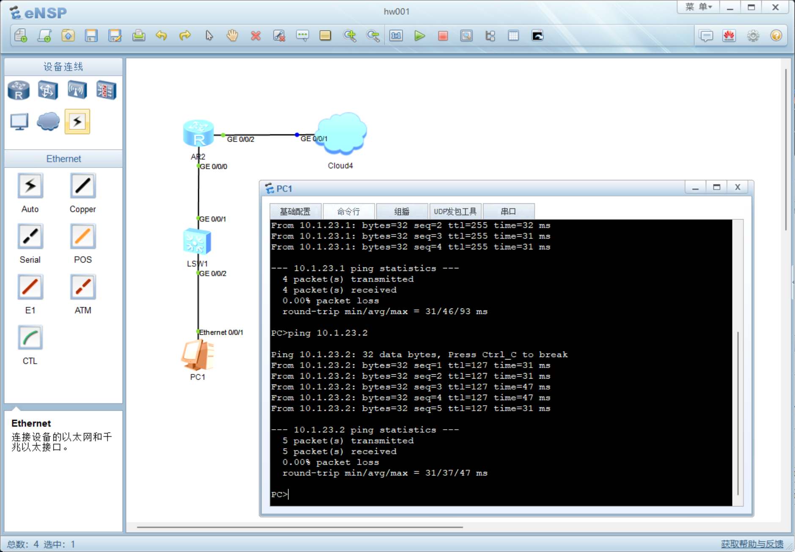

# 模拟内网接入电脑

## 配置路由

- 添加配置

```
<Huawei>sy
[Huawei]int g0/0/2
[Huawei-GigabitEthernet0/0/2]port link-type access 
[Huawei-GigabitEthernet0/0/2]port default vlan 10
```

- 保存配置

```
[Huawei-GigabitEthernet0/0/2]q
[Huawei]q
<Huawei>save
The current configuration will be written to the device.
Are you sure to continue?[Y/N]y
Now saving the current configuration to the slot 0.
Save the configuration successfully.
```

## 添加PC




