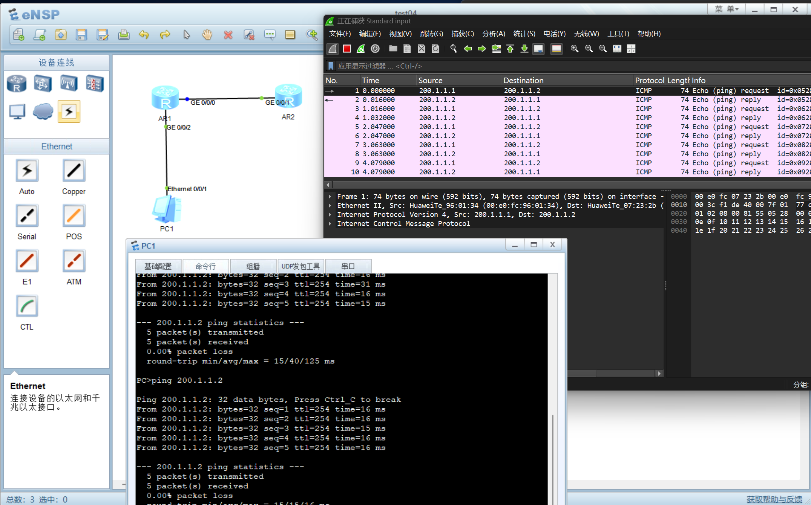
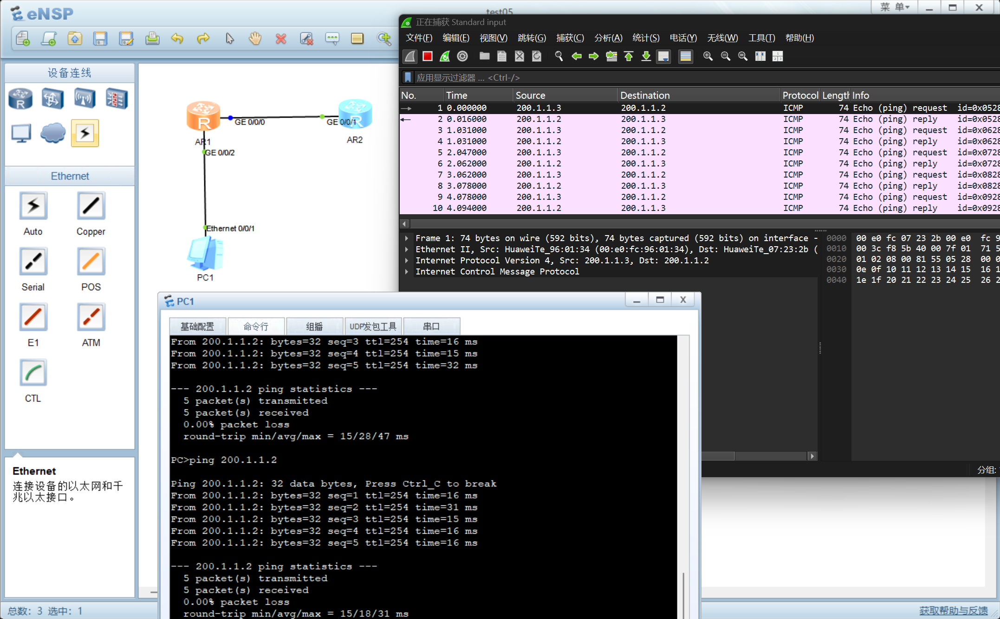

# 测试结果

## NAT转发

- 实验test04
  - 实验结果：成功
  - 实验截图：
- 实验test05
  - 实验结果：成功
  - 实验截图：
  - 注意地址池的配置

```bash
[R1]undo nat address-group 1
[R1]nat address-group 1 200.1.1.3 200.1.1.20
[R1-GigabitEthernet0/0/0]nat outbound 2000 address-group 1
```


在 eNSP 上验证这个 NAT 需求，核心思路是**搭建一个包含内网、出口路由器和模拟公网的最小拓扑**，然后通过抓包来观察源 IP 的变化。针对你提供的两种脚本，具体验证步骤如下：

### 第一步：搭建验证拓扑
建议用 3 台设备就能完成验证：
1.  **内网 PC**：配置 IP `192.168.10.10/24`，网关 `192.168.10.1`。
2.  **出口路由器 R1**：即你脚本中的设备，连接内网和公网。
3.  **模拟公网设备**：可以用另一台路由器（如 R2）或直接使用一台 PC，配置 IP `200.1.1.2/24`，并将网关指向 R1 的公网口 `200.1.1.1`。

### 第二步：验证 Easy IP（NAPT）
这是最常用的方式，对应你脚本中的第一段。

1.  **配置 R1**：按照脚本配置接口 IP、ACL 2000，并在公网接口 `G0/0/0` 下执行 `nat outbound 2000`。
2.  **启动抓包**：在 eNSP 拓扑中，右键点击 R1 的公网接口 `G0/0/0`（连接 R2 的线），选择“数据抓包”，Wireshark 会自动打开。
3.  **产生流量**：在内网 PC 上 ping 公网设备 `200.1.1.2`。
4.  **分析报文**：
    *   在 Wireshark 过滤器中输入 `icmp` 查看报文。
    *   你会发现，**源 IP 地址从 `192.168.10.10` 变成了 `200.1.1.1`**（R1 的公网接口地址），这就是 Easy IP 的特征。

### 第三步：验证 NAT 地址池方式
对应你脚本的第二段，验证方法和上面类似，区别在于公网源 IP 是否固定。

1.  **修改 R1 配置**：先 `undo nat outbound 2000` 删除 Easy IP，然后按脚本配置 `nat address-group 1 200.1.1.10 200.1.1.20`，最后在接口下引用：`nat outbound 2000 address-group 1`。
2.  **再次抓包**：同样在 `G0/0/0` 接口抓包，内网 PC 再次 ping 公网地址。
3.  **观察结果**：此时源 IP 会被转换为地址池范围内的地址（例如 `200.1.1.10` 或 `200.1.1.11`），而不是接口本身的 `200.1.1.1`。

### 关键提醒
*   **路由可达**：为了让 R1 能将包转发出去，需要在 R1 上配置一条指向公网设备的默认路由，例如 `ip route-static 0.0.0.0 0 200.1.1.2`。
*   **公网设备回程路由**：为了让公网设备（R2）能把回复包送回给地址池里的 IP（`200.1.1.10-20`），需要在 R2 上配置一条回程路由，例如 `ip route-static 200.1.1.0 24 200.1.1.1`，或者直接配置 `ip route-static 0.0.0.0 0 200.1.1.1` 简化操作。